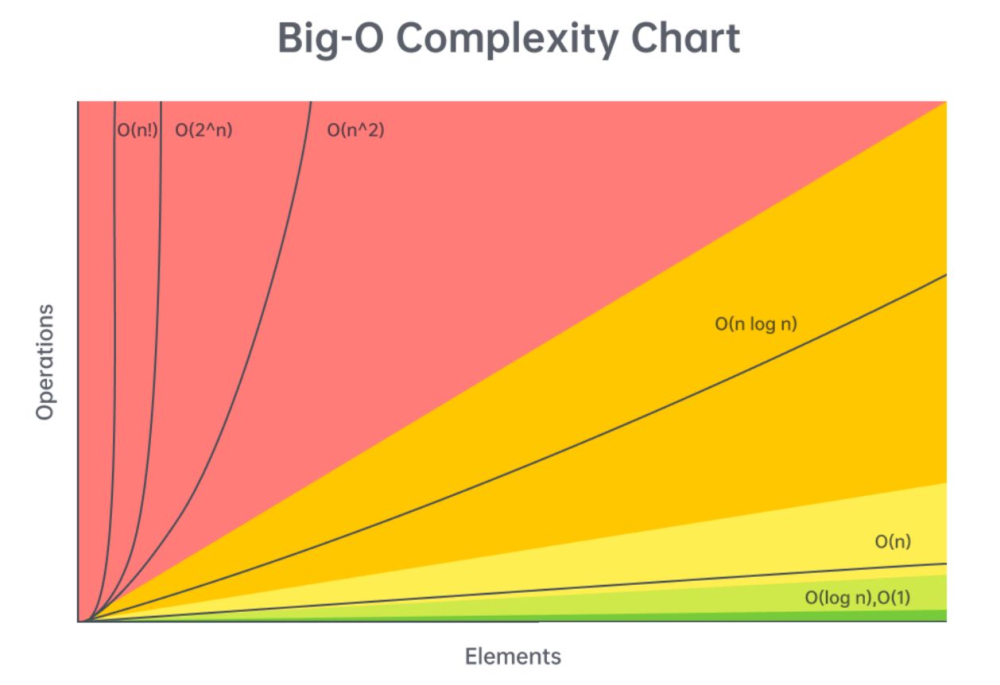

# LeetCode Algorithm Complexity Chart

This repository contains a visual chart of time and space complexity for common programming algorithms, sourced from [LeetCode](https://leetcode.com/). The chart is useful for understanding the efficiency of algorithms and preparing for coding interviews.

- **Time complexity (Big O) cheat sheet**

-  **Sorting Algorithm Complexity**

## Keywords
- LeetCode algorithm complexity
- Time and space complexity chart
- Programming algorithms
- Coding interview preparation
- Algorithm efficiency
- Big O notation
- Data structures and algorithms

## How to Use
- Refer to the chart to understand the time and space complexity of common algorithms.
- Use this as a quick reference during coding interviews or algorithm practice.

## Credit
- The complexity chart is sourced from - The complexity chart is sourced from [LeetCode's Algorithm Complexity Cheatsheet](https://leetcode.com/explore/interview/card/cheatsheets/720/resources/4725/), a comprehensive resource for algorithm analysis and coding interview preparation., a popular platform for practicing coding interview questions and learning algorithms.

## License
This project is licensed under the MIT License. See the [LICENSE](LICENSE) file for details.
